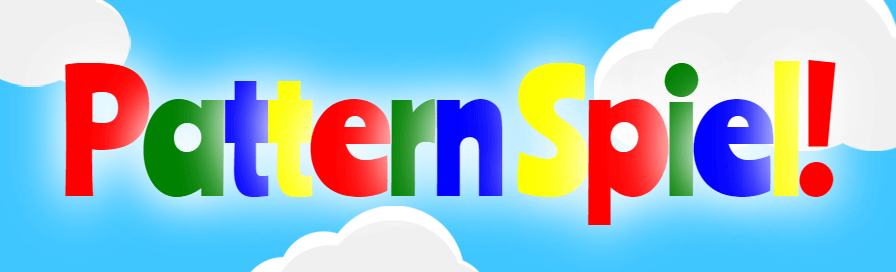
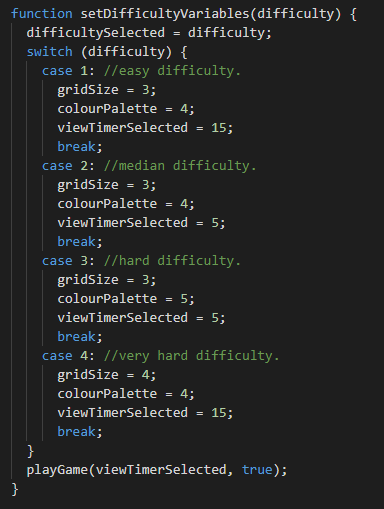

# Pattern Spiel (Pattern Play) - Readme document

  

### Website can be viewed here: https://c-undritz.github.io/Pattern-Spiel/
### Project GitHub site: https://github.com/C-Undritz/Pattern-Spiel

### **Disclaimer: This Website is for educational purposes only.**
---
># **OVERVIEW**

Memory and puzzle games are popular with all age groups as a way to pass the time, relax and to learn.  Improvement in technology such as mobile smart phones and internet browsers have resulted in these games becoming more accessible meaning that they can be easily accessed and played anywhere and on many devices.  

This project uses HTML5, CSS and JavaScript to power a responsive web app game called Pattern Spiel (Pattern Play) where the player is asked to memorise a random pattern and the recreate it to gain a win (if the player pattern matches) or loss (if they do not).

---
># **STRATEGY**

People play games for the same reason that people have played boards games for over 3500 years; they are fun!  Games can range from the highly complex to the very simple but the fun factor is often not a function of the complexity; often the most fun can be the simplest (Tetris).  Pattern Spiel is definitely a simple game which means that it can be easily picked up and played as a simple diversion by a range of people and ages.

However in addition to the fun factor, research has also be conducted into the possible health and cognitive benefits of memory/puzzle games.  

In older age groups, current findings suggest that these sorts of games may help may help sharpen certain thinking skills that tend to wane with age, such as processing speed, planning skills, reaction time, decision making, and short-term memory.  Whilst more research needs to be conducted it is suggested that brain games can play an important role in maintaining overall brain health and can maintain or even improve cognitive skills among older people at very high risk of cognitive decline.

In early years and the school environment research has shown that playing memory games can improve attention, concentration,  focus, visual recognition  and visual discrimination . It has also been shown that having a digital variant of a analogue game can lead to different strategies being explored and developed over those deployed for an analogue variant.

The main aim of this product is to provide a game that is compelling and fun, and offers a challenge to all abilities no matter the age of the player.  Difficulty is key; if the player has mastered a challenge their brain will not be stimulated as much.  They will need a new challehge to force their brain to work and learn!  Therefore set difficulty levels as well as the ability to define a custom challenge have been implemented. 

To ensure that all age groups and abilities can access this game a goal of the product has been to also make it simple and intuitive to interface with.  Whilst more research would have to be done specifically into this game to align it with any specific gains outside of 'having fun', in its present form it is an ideal offering to schools as a learning aid (especially in key stages 1 and 2), and other care environments.  

---
# User Stories

The game should appeal across a number of age ranges and most user stories will apply to all of these.  

As a user of this software I want to:
* *Be able to easily play the game on any device*
* *Have my memory skills challenged with a fun game*
* *Have set difficulty levels so I can determine the level of challenge*
* *Customise the game options so I can set my own challenge*
* *Have a record/score to see how much I have improved so as to challenge myself and my peers.*
* *Be able to easily navigate the game and site.*
* *I want have clear instructions so I know how to play.*
* *I want to be able to provide feedback/suggestions/issues to the developer.*

---
># **SCOPE**
# Content
The product is a style of a memory pattern matching game that offers varying levels of challenge.

## The high level gameplay.
1. The landing page presents the user with three buttons: 'Start', 'How to Play' and 'High Scores'.
2. Upon clicking start the player can select four levels of set difficulty (easy, medium, hard and very hard) as well as a 'Custom game' option where the player can set their own level of challenge.  
3. Each game consists of fine rounds where for each round the user is asked to match the pattern shown.  
4. The first game screen shows a pattern which the player can observe for a period of time.
5. Once the time runs out, the grid is then displayed as empty and the player must select colours from a palette to recreate the pattern.
6. At the end of each round a message displays informing a win or loss as well as the time taken.  Players can also compare their result against the original pattern if they choose.
7. Results are shown for each round as a win/loss as well as the time taken in the results column or the results pop-up modal (for tablets and mobiles).   
8. After five rounds the player is informed of their score, the opportunity to save it, and then asked whether they would like to play again or return to the main menu.

## The presentation of the game is concerned with:
1.	Being fun and engaging from the outset to encourage the player to explore the game
2.	being simple to use; effectively this is a few pages with the interactive elements presented only when they need to be for ease of navigation.

## Functional Requirements.
1.	All game screens fit onto one page; no scrolling required
2.  Responsive design; assumption is that most users will browse through to the site from a mobile or tablet.
3.  Automation as much a possible for ease of play; the game should drive itself, or if the player has to click something, options are obvious and focused at that time.
4.	A link to the main menu from button shown at all times so that the user is not stuck in a game and either has to complete it or user browser functions to exit.
5.	A feedback function/form that will allow the sending of feedback to an existing email using JSMail
6.	Clear and obvious links to social media platforms
7.	Feedback animations and sounds to provide user with clear interaction cues.

---
># **STRUCTURE**

1. The website consists of one main page where buttons and game elements are presented when they are needed both before and within the gameplay loop
2. Three other pages are included in the final product:

	* How to Play (instructions)
	* High Scores
	* Contact Us (feedback form)

---
# Navigation
Navigation through the site is facilitated by overt buttons and is as follows:

## Landing page / Main menu: 
1. Centred Call to Action buttons, with the top button asking the player to 'Start'.  Upon clicking this button, the user is taken through gameplay options and selects one to progress.  Once all options are settled a single button is shown stating 'Play Game!'; this will start the game.
2. At all stages of the menu options a return button is present at the bottom of the buttons for the user to return to the previous menu options. 
3. A 'Main menu' button is present below the 'Play Game!' button so if required the user can go to the main menu again if they wish.
2. Centred 'How to play' button situated below the Start button.  This takes the user to a separate page detailing the game functions and instructions on how to play.
3. A 'Contact Us' button situated at the bottom of the main menu page alongside the facebook and instagram social media icons.  This takes the user to a separate page featuring a contact form.

## How to Play page:
1. Top centred button stating 'Main menu', which takes the user back to the main menu.

## Contact Us page:
1. A centred 'Main menu' button beneath the 'submit' button of the form, which takes the user back to the main menu.

## Within game:

1. Once the game has started, a 'Main menu' button will be available at the top of the result column at the top left of the page.  For tablets and mobile the main menu button is shown top left of the screen.  This takes the player back to the main menu at any point in the game.
2. For tablets and mobile displays, the results are not permanently on display and are accessed by tapping the 'results' button alongside the main menu button at the top right of the screen.  This opens a pop-up modal that displays the results.

---
# Consistent Features between pages
* The same background is shown at all times across all pages.
* Buttons and user interaction feedback

---
># **SKELETON**
## Wireframes
* [first draft](assets/readme/PatternSpiel-Wireframes_v0.2.pdf)

* Revised and final versions reflecting changes during development:
	* [Mobile](assets/readme/patternspiel-mobile-wireframes_v1.0.pdf)
	* [Tablet](assets/readme/patternspiel-tablet-wireframes_v1.0.pdf)
	* [Desktop](assets/readme/patternspiel-desktop-wireframes_v1.0.pdf)

---
># **SURFACE**

## Theme
The aim is to create a fun and engaging game from the outset to encourage the player to explore further.  Therefore it was decided early to use bright primary colours.  Originally it was planned to have the same colours in the background but mute them through a filter.  However in practice this was a very busy design and, despite the filter, did not work well with the pattern display.

Therefore it was decided to go opposite to this and create an almost minimalist background that used pale colours to allow the primary colours to pop.  A cartoon cloud background was settled on that was in keeping with the playful theme.

## Colours
The colours selected for the game are the bright primary colours 

- red (255,0,0, #ff0000)
- green (0,128,0 #008000)
- blue (0,0,255 #0000ff)
- yellow (255,244,36 ##FFF424)
- purple (128,0,128 #800080)
- orange (255,165,0 #ffa500)

These colours are used throughout the game for the pattern colours, the buttons and the title and sub-titles.  The use of colours in the buttons and text follows as much as possible the following sequence; red, green, blue, yellow.

Purple and orange are only used in the palette when 5 or 6 colours are within the difficulty chosen or when chosen in the custom game.

## Text
### Fonts chosen:
* For the title and sub-titles: [Ranchers](https://fonts.google.com/specimen/Ranchers?preview.text=Pattern%20Spielen!&preview.text_type=custom#standard-styles)
* For the message, paragraphs and button text: [Truculenta](https://fonts.google.com/specimen/Truculenta?preview.text_type=custom)

### Font colours:
The colours selected for the text are two shades of grey:
* #808080: Used for the text and symbols on the yellow buttons, and the menu guide text (text that appears above buttons in the menu).
* #666666: Used for all other text as a darker shade of grey was required for this.

### Text Shadow:
The cloud theme background inspired the use of a cloud like text shadow which has been applied to the titles and sub-titles

### Message backgrounds:
The cloud theme background inspired the use of a white translucent background and a box shadow to give a cloud like appearance.  This is applied to all messages and most paragraphs.

---
# Technologies used
* HTML5
* CSS3
* JavaScript 
* Bootstrap
* Gitpod
* GitHub
* GoogleFonts
* Fontawesome
* Balsamiq
* Adobe Photoshop

## Game Logic flow diagram (JavaScript functions)
* [Current version (1.6)](assets/readme/patternspiel-logic_v1.6.pdf)

---
># **TESTING**
Testing completed is detailed in the [TESTING.md](TESTING.md) document

---
># **NOTED DESIGN CHANGES**

### High score.
* At the start of development it was not envisaged that there would be a high score result from a game and therefore no high score table for the primary reason that it was not known at that point how it would be done with local storage.  This knowledge was however gained and so a score method was devised along with the required JS code to display and save this within the game.  within the main menu, a 'High Scores' button and page was added to the main menu.

### Play timer (time limit).
* A time limit to complete the pattern was not implemented in the end.  This was an amount of time that the player would have to recreate the pattern to provide a more relaxed approach to the game.  Instead the time achievement for each round is displayed and a quick time is recognised in the player game score to incentivise quick play.

### Colour palette position.
* The final implementation has the colour palette displayed below the grid and not vertically on the right hand side for all screen sizes (as shown in original wireframes).  This was changed so that more of the screen was available for the grid at mobile screen sizes and so the all game components where centered in the middle of the screen at all screen sizes.

### Display of grids during pattern comparison.
* The original design was to have the computer pattern appear alongside the player pattern at the end of a round for the player to compare.  This was changed to a more elegant solution of having a button display on this screen that lets the player flip between the two.  Having the two grids display alongside each other would have been difficult to code and also accomodate at smaller screen sizes.

### Round count.
* Play testing (amoungst family and friends) revealed that ten rounds as per the original design, was too many.  This was easily changed to five and meant that the player was more likely to completed all of the rounds for a complete game and get a score.

### Contact button and social media icons.
* It was decided, for asthetics, to have the contact us button rounded and displayed center bottom of screen with social media icons.  It was also decided that it should only display the contact button and social media icons on the main menu screen and not within the game as per the original design.  Only game features are shown during the game.   

### Added a fourth difficulty level.
* It was felt that a fourth level of difficulty was needed to represent the variety that could be offered by the game parameters.  This could have been 'very easy' or 'very hard'.  Very hard was decided upon as the title conveys challenge.  

### Results display on tablets.
* The original design had the score column show on tablets.  However it was decided that the tablet would screen would mirror the mobile screens and have the 'results' and 'main menu' buttons at the top of the screen.  this was to provide a consistent 'mobile' device experience and allow for more space for the grid on this smaller screen size.

### Position of View Timer (countdown).
* The original design had the View timer (countdown) below the pattern.  It was moved to above the pattern for asthetics.

---
># **FEATURES FOR FURTHER DEVELOPMENT**
### 1. High Scores storage.
* Currently the high scores are stored in local storage.  It is planned that this will move to a central database.  This will have two benefits:
	1. It would remove the ability for the players to change scores within local storage by directly editing values.
	2. It will allow for competition across devices and the wider player base.
	
### 2. Friends feature.
* Allow user to add friends to there game which could be facilitated vis a facebook friends list.  This will allow scores to be compared between friends for additional competition.  

### 3. Integration with social media.
* Develop further the integration with social media platforms to raise profile of the game and developer.  in this players can:
	* post high scores automatically when conditions are met.
	* post screen shots.
	* converse with friends about the game.

### 4. High Score for custom game.
* There are 24 combinations for the custom game which is a lot but it would not be hard to set up a database and so high scores for these games could be saved within a database to create further player competition.

---
># **DEVELOPMENT & DEPLOYMENT**
* A repository was setup in GitHub using the Code Institute Gitpod [full template]( https://github.com/Code-Institute-Org/gitpod-full-template).
* All development was completed using Gitpod and code was regularly pushed back to the GitHub repository.
---
# Website deployment.
The following steps were taken in GitHub to deploy the site and can be replicated:
1.	Login to GitHub
2.	From the list of repositories select the desired repository
3.	From the list of nine options underneath the repository name; select ‘Settings’
4.	Scroll down to the section titled ‘GitHub Pages’
5.	In that section, under ‘source’, click the drop down menu and select the ‘master’ branch
6.	In the drop down menu next to that select ‘root’
7.	Click save
8.	A message is displayed in this section stating that the site is published and the address of the site. Click this to view the site

Note that it can sometimes take up to 20 minutes for the site to publish so be patient.  Please see [here](https://docs.github.com/en/free-pro-team@latest/github/working-with-github-pages/configuring-a-publishing-source-for-your-github-pages-site#choosing-a-publishing-source) for the GitHub Docs page on this process.

---
# Running the project locally.
To work on the project code locally a clone can be taken by following the steps below or downloading the files as a zip file.  To see the options open the desired repository and select the drop down menu button ‘Code’ (found under the repo name and above the list of files)

## Clone:
To do this you will need [GitBash for Windows](https://gitforwindows.org/) installed (for other OS versions see [here](https://git-scm.com/downloads).
1. Open GitBash
2. Change the current working directory is required.  On windows, by default, the files will be downloaded to the users file directory on the C: drive
3. In the ‘Code’ dropdown menu in GitHub, select either HTTPS or SSH and copy the link.
4. In the GitBash window type ‘git clone’ and then paste the copied link:

5. Hit Enter and the files will then be cloned to be worked on locally.

Please see [here](https://docs.github.com/en/free-pro-team@latest/github/creating-cloning-and-archiving-repositories/cloning-a-repository) for the GitHub Docs page on this process.

---
># **MODIFYING THE GAME**
## Game Difficulty.
Difficulty is subjective and the set difficulty settings have changed throughout the course of development.  Fortuanately the set difficulty settings are very easy to change and below describes how.

The difficulty offered by the set difficulties is described in the how to play page and each is function of the grid size, colour number and view timer.  These are set at certain levels for the set difficulties within the JavaScript with number values that can be changed easily to adjust the challenge offered at each of the difficulty levels.

Shown below: This can be done within the 'script.js' file by changing the value assigned to the variables in case statements within the function 'setDifficultyVariables'.

### Viable values for each variable:
* gridSize: can be either 3 (3x3 grid) or 4 (4x4 grid).
* colourPalette: can be either 4, 5 or 6 to represent the number of colours in the pattern and palette.
* viewTimerSelected: can be either 0 (no timer) or 5, 10 or 15 to represent the number of seconds.

---
># **CREDITS & THANKS**
## Code

* The function ViewTimer() timer code was learnt and adapted from 'Code with Ania Kubów' Youtube 
channel video: "Build your own COUNTDOWN TIMER in 15 lines of JavaScript code" 
(https://www.youtube.com/watch?v=vSV_Ml2_A88&t=19s).

* The functions playerTimer(), runPlayerTimer() and stopPlayerTimer() was learnt and adapted from 
'VerkkoNet' Youtube channel video: "Stopwatch in JS | JavaScript Tutorials | Web Development Tutorials"
(https://www.youtube.com/watch?v=oY8V6GuZrkM).

* How to save, update and display the scores using local storage was learnt from the following YouTube videos from the channel 'James Q Quick' and adapted for the game:

	1. [Build a Quiz App (7) - Create and Style the End Page](https://www.youtube.com/watch?v=o3MF_JmQxYg)
	2. [Build a Quiz App (8) - Save High Scores in Local Storage](https://www.youtube.com/watch?v=DFhmNLKwwGw)
	3. [Build a Quiz App (9) - Load and Display High Scores from Local Storage](https://www.youtube.com/watch?v=jfOv18lCMmw)

* Adding sound effects code for the pickColour() and addColour() functions was learnt from MDN Web Docs 'Audio
for Web games" (https://developer.mozilla.org/en-US/docs/Games/Techniques/Audio_for_Web_Games).

* The code for having the sound effects cease upon rapid clicking of the palette or grid was learnt from
stackoverflow.com post "How to stop audio played by audio tag of HTML5" (https://stackoverflow.com/questions/3566967/how-to-stop-audio-played-by-audio-tag-of-html5).

* The code for cloning a created element within JS so that is can be used again (used for adding the score-box 
to both the mobile score button and score column) was learnt from stackoverflow.com post "Insert HTML element 
two (or more) times using JavaScript" (https://stackoverflow.com/questions/6244985/insert-html-element-two-or-more-times-using-javascript).

* Struggled to get a space between words in the html when wrapping them in 'span' tags.  Have used '&nbsp;' before but did not think to use it at the end of words to force a space.  When researching, [this page](https://crunchify.com/basic-html-how-do-you-create-blank-space-in-html/) provided this fix.

---
# Images and Content
## Images:
* All images used were created by Christopher Undritz for this project using AdobePhotoshop 

## Sound:
* Sound effects used were royalty free and downloaded from: https://mixkit.co/free-sound-effects/

## Content:
* Information for Readme strategy section was found in the following websites:
	* [Health Harvard](https://www.health.harvard.edu/mind-and-mood/the-thinking-on-brain-games)
	* [curiousworld.com](https://www.curiousworld.com/blog/importance-playing-memory-games)
	* [Taylor & Francis Online](https://www.tandfonline.com/doi/full/10.1080/09575146.2018.1460803)

---
# Acknowledgments

* Thanks to Code Institute for the excellent course content (referenced many times) and student/tutor support that has allowed me to complete this!
* Despite following the Youtube tutorial for the viewTimer() function, the clearInterval method was not initiating the player
generatePlayerGrid() function as required.  Thanks to Mr_Bim_alumni who pointed out that the setInterval method should be 
declared as a variable so that the timer could be ceased with the clearInterval method.
* Thanks to my mentor Adegbenga Adeye for his feedback and support throughout this challenging second milestone project.

