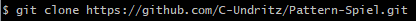

# Pattern Spiel (Pattern Play) - Readme document

### Website can be viewed here: 
### Project GitHub site: 

### **Disclaimer: This Website is for educational purposes only.**
---
># **OVERVIEW**

Memory and puzzle games are popular with all age groups as a way to pass the time, relax and to learn.  Improvement in technology such as mobile smart phones and internet browsers have resulted in these games becoming more accessible meaning that they can be easily accessed and played anywhere and on many devices.  

This project uses HTML5, CSS and JavaScript to power a responsive web app game called Pattern Spiel (Pattern Play) where the player is asked to memorise a random pattern and the recreate it to gain a win (if the player pattern matches) or loss (if it does not).

---
># **STRATEGY**

People play games for the same reason that people have played boards games for over 3500 years; they are fun!  Games can range from the highly complex to the very simple but the fun factor is often not a function of the complexity; often the most fun can be the simplest (Tetris).  Pattern Spiel is definitely a simple game which means that it can be easily picked up and played as a simple diversion by a range of people and ages.

However in addition to the fun factor, research has also be conducted into the possible health and cognitive benefits of memory/puzzle games.  

In older age groups on learning ability and the preservation of cognitive function in particular age groups.  Current finding suggest that these sorts of games may help may help sharpen certain thinking skills that tend to wane with age, such as processing speed, planning skills, reaction time, decision making, and short-term memory.  Whilst more research needs to be conducted it is suggested that brain games can play an important role in maintaining overall brain health and can maintain or even improve cognitive skills among older people at very high risk of cognitive decline.

In early years and the school environment research has shown that playing memory games can improve attention, concentration,  focus, visual recognition, visual discrimination . It has also been shown that having a digital variant of a analogue game can lead to different strategies being explored and developed over those deployed for the analogue variant.

The main aim of this product is to provide a game that is compelling and fun, and offers a challenge to all abilities no matter the age of the player.  To ensure that all age groups and abilities can access this game a goal of the product will be to also make it simple and intuitive to interface with.  Whilst more research would have to be done specifically into this game to align it with any specific gains outside of 'having fun', it could also be offered to schools as a learning aid (especially in key stages 1 and 2), and other care environments.  

---
# User Stories

The game should appeal across a number of age ranges and most user stories will apply to all of these.  

As a user of this software I want to:
* *Be able to easily play the game on any device*
* *Have my memory skills challenged with a fun game*
* *Have set skill levels so I can determine the level of challenge*
* *Customise the game options so I can set my own challenge*
* *Have a record/score to see how much I have improved so as to challenge myself and my peers.*
* *Be able to easily navigate the game and site.*
* *I want have clear instructions so I know how to play.*
* *I want to be able to provide feedback/suggestions/issues to the developer.*

---
># **SCOPE**
# Content
The site will offer a single style of a memory pattern matching game that offers varying levels of challenge

## The high level gameplay loop  
1. The landing page presents the user with ?two? buttons: 'start' and 'how to play'.  How to play will take the user to a brief instructions page where they can learn how to play and how the game functions.
2. Upon clicking start the player will be offered three levels of set difficulty (easy, medium and hard) as well as a 'customise game' option where the player can set their own level of challenge.  
3. Each game will consist of ten rounds where for each round the user will be asked to match the pattern shown.  The score will be recorded as a win/loss based on 1) whether they completed the correct pattern and 2) whether they did this within the time limit.  
4. If a win is recorded the time taken for the player to complete this is recorded and displayed against the win.  The score for all rounds is displayed on the screen and updated between rounds.
5. After ten rounds the player is informed of their score and then asked whether they would like to play again or return to the main menu.

## The presentation of the game is concerned with:
1.	Being engaging from the outset to encourage the player to explore the game
2.	being simple to use; effectively this is a few pages with the interactive elements presented only when they need to be for ease of navigation.

## Functional Requirements.
1.	Responsive design; assumption is that most users will browse through to the site from a mobile or tablet, therefore Bootstrap grid/CSS grid was used to ensure that the website is responsive.
3.	Link to main menu from button positioned ?
4.	A feedback function/form that will allow the sending of feedback to an existing email using JSMail
5.	Clear and obvious links to social media platforms
6.	Feedback animations and sounds to provide user with clear interaction cues for buttons, media boxes and links

---
># **STRUCTURE**

1. The website consists of 1 main page where buttons and game elements are presented when they are needed both before and within the gameplay loop.
2. Two other pages are included in the final product:

	* instructions
	* feedback form

3. The logic of the gameplay and the JS functions can be viewed [here](assets/readme/PatternSpiel-Logic_v0.1.pdf).
---
# Navigation
Navigation through the site is facilitated by overt buttons and will be presented as follows

Landing page: 

1. Centred Call to Action button asking the player to 'start'.  Upon clicking this button, the user is taken through gameplay options.  Once all options are settled a single button is shown stating 'Play'; this will start the game.
2. Centred 'How to play' button situated above the Start button.  This takes the user to a separate page detailing the game functions and instructions on how to play.
3. A 'Contact Us' button situated lower right of the page.  This takes the user to a separate page featuring a contact form.

How to Play page:

1. Bottom centred button stating 'Main menu', which takes the user back to the landing page.

Contact Us page:

1. A centred 'Main menu' button beneath the 'submit' button of the form, which takes the user back to the landing page.

Within game:

1. Once the game has started, a 'Main menu' button will be available above the score display in the top left of the page.  This will take the player back to the landing page at any point in the game.

This is in line with current website design and UX trends.

---
# Consistent Features between pages
Social media icons linking to the Facebook, twitter, and Instagram will be shown at all times at the bottom of the screen.

The same background will be shown at all times with a translucent overlay, that will vary between four/five random colours each time the game loads so as to add additional engagement and sense of fun to the site.

---
># **SKELETON**
# Wireframes
* [Current version (0.2)](assets/readme/PatternSpiel-Wireframes_v0.2.pdf)

---
# Home/landing page
To have the most impact, the home screen features the name of the game in large colourful letters.  The colours used are those used in the game.  These are the bold and bright colours translated by HTML as 'red', 'green', 'blue', 'yellow', 'orange' and 'purple'.   below this are the buttons 'How to play' and 'Start'.  A 'contact' button is displayed in the lower right of the page.  The background is ?.  This positioning is maintained on tablet and mobile.

The buttons have an appropriate hover and click user feedback.

Music also plays when the users starts the page which can be muted.

---
# How to Play
The 'How to play' features details on how to play and screen grabs to illustrate this as well as a main menu button take the player back to the landing page. contact page features a contact form which requests:

# Contact Us
The contact page features a contact form which requests:
* User's name
* User's email address
* Details of their query/feedback

These are all required input for the query to be sent

The form finishes with a ‘Submit’ button.

Below the submit button is a main menu button take the player back to the landing page.

---
># **SURFACE**

# Colours
The colours selected for the game are the bright primary colours 

- red (255,0,0,)
- green (0,128,0)
- blue (0,0,255)
- yellow (255,255,0)
- purple (128,0,128)
- orange (255,165,0)

These colours are reflected in the design for the rest of the site being used for buttons and the background.

---
# Fonts
Fonts chosen:
* For the title: [Ranchers](https://fonts.google.com/specimen/Ranchers?preview.text=Pattern%20Spielen!&preview.text_type=custom#standard-styles)
* For the paragraphs and Headings: [Roboto](https://fonts.google.com/specimen/Roboto)
* For the paragraphs and Headings: [Truculenta](https://fonts.google.com/specimen/Truculenta?preview.text_type=custom)

---
# Technologies used
* HTML5
* CSS3
* JavaScript 
* JQuery
* Bootstrap
* CSS Grid
* Gitpod
* GitHub
* GoogleFonts
* Fontawesome
* Balsamiq

Bootstrap technology used:?
* Container
* Grid
* Buttons
* Card
* Carousel
* Modal
* Navbar
* Flex
* Spacing

---
># **TESTING**
Testing completed is detailed in the [TESTING.md](TESTING.md) document

---
># **NOTED DESIGN CHANGES**
>

---
># **FEATURES FOR FURTHER DEVELOPMENT**
>

---
># **DEVELOPMENT & DEPLOYMENT**
* A repository was setup in GitHub using the Code Institute Gitpod [full template]( https://github.com/Code-Institute-Org/gitpod-full-template).
* All development was completed using Gitpod and code was regularly pushed back to the GitHub repository.
---
# Website deployment.
The following steps were taken in GitHub to deploy the site and can be replicated:
1.	Login to GitHub
2.	From the list of repositories select the desired repository
3.	From the list of nine options underneath the repository name; select ‘Settings’
4.	Scroll down to the section titled ‘GitHub Pages’
5.	In that section, under ‘source’, click the drop down menu and select the ‘master’ branch
6.	In the drop down menu next to that select ‘root’
7.	Click save
8.	A message is displayed in this section stating that the site is published and the address of the site. Click this to view the site

Note that it can sometimes take up to 20 minutes for the site to publish so be patient.  Please see [here](https://docs.github.com/en/free-pro-team@latest/github/working-with-github-pages/configuring-a-publishing-source-for-your-github-pages-site#choosing-a-publishing-source) for the GitHub Docs page on this process.

---
# Running the project locally.
To work on the project code locally a clone can be taken by following the steps below or downloading the files as a zip file.  To see the options open the desired repository and select the drop down menu button ‘Code’ (found under the repo name and above the list of files)

## Clone:
To do this you will need [GitBash for Windows](https://gitforwindows.org/) installed (for other OS versions see https://git-scm.com/downloads).
1. Open GitBash
2. Change the current working directory is required.  On windows, by default, the files will be downloaded to the users file directory on the C: drive
3. In the ‘Code’ dropdown menu in GitHub, select either HTTPS or SSH and copy the link.
4. In the GitBash window type ‘git clone’ and then paste the copied link:

5. Hit Enter and the files will then be cloned to be worked on locally.

Please see [here](https://docs.github.com/en/free-pro-team@latest/github/creating-cloning-and-archiving-repositories/cloning-a-repository) for the GitHub Docs page on this process.

---
># **CREDITS & THANKS**
# Code

---
# Images and Content
## Images:
## Content:

---
# Acknowledgments

