# Pattern Spiel - Testing document

## [Associated Readme document](README.md)

---
# Table of Contents
* [**RESPONSIVE DESIGN TESTING**](#--responsive-design-testing--)
* [**FUNCTIONALITY TESTING**](#--functionality-testing--)
* [**QUALITY CHECKS**](#--quality-checks--)
* [**USER STORIES TESTING**](#--user-stories-testing--)
* [**PROBLEMS AND FIXES**](#--problems-and-fixes--)
* [**REMAINING ISSUES**](#--remaining-issues--)

---
># **RESPONSIVE DESIGN TESTING**
Testing of the expected presentation and display of all elements of the game was conducted and can be viewed on the link below:
* [Presentation & display testing results](assets/readme/testing_pattern-spiel_display.pdf)

Research detailed screen resolutions that are most popular today (see [here](https://kinsta.com/blog/responsive-web-design/#common-responsive-breakpoints) and [here](https://www.browserstack.com/guide/responsive-design-breakpoints)).  This information was used along with the required resolutions for [am-i-responsive](http://ami.responsivedesign.is/) to determine 16 resolutions as a guide for media breakpoints and to test for responsive design. 

Responsiveness testing of the menu screen and game was completed against these resolutions using Google Chrome DevTools. The resolutions tested were:

    * 1920 x 1080
    * 1600 x 992
    * 1536 x 864
    * 1366 x 768
    * 1280 x 802
    * 768 x 1024
    * 540 x 720 (Surface Duo)
    * 414 x 896
    * 411 x 731 (Pixel 2)
    * 411 x 823 (Pixel 2 XL)
    * 375 x 812 (iPhone X)
    * 375 x 667 (iPhone 6/7/8)
    * 360 x 720
    * 360 x 640
    * 320 x 568 (iPhone 5)
    * 320 x 480

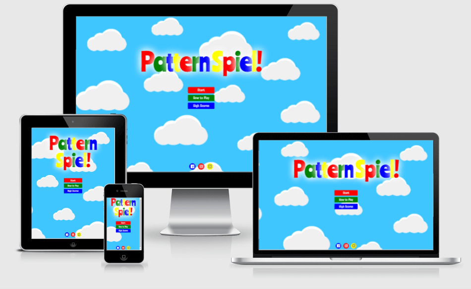
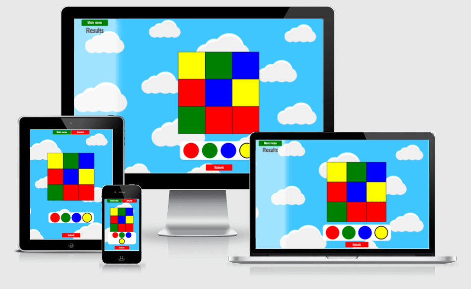
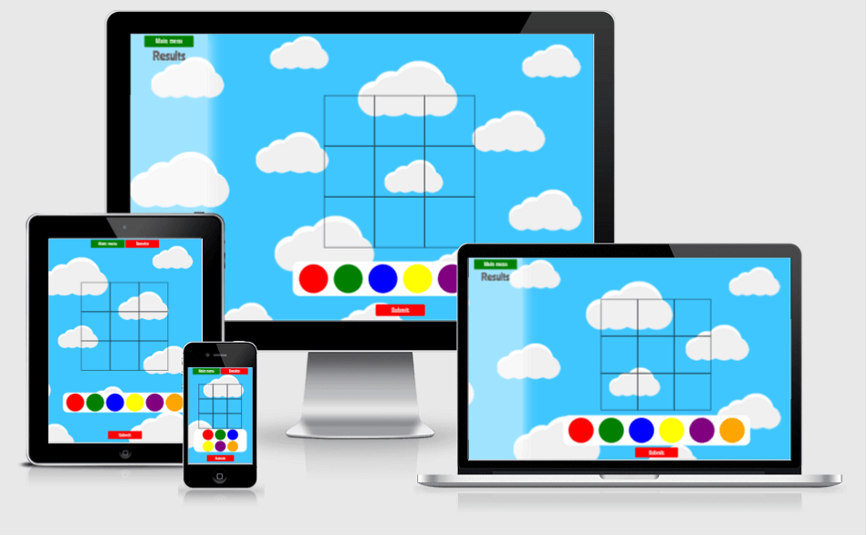
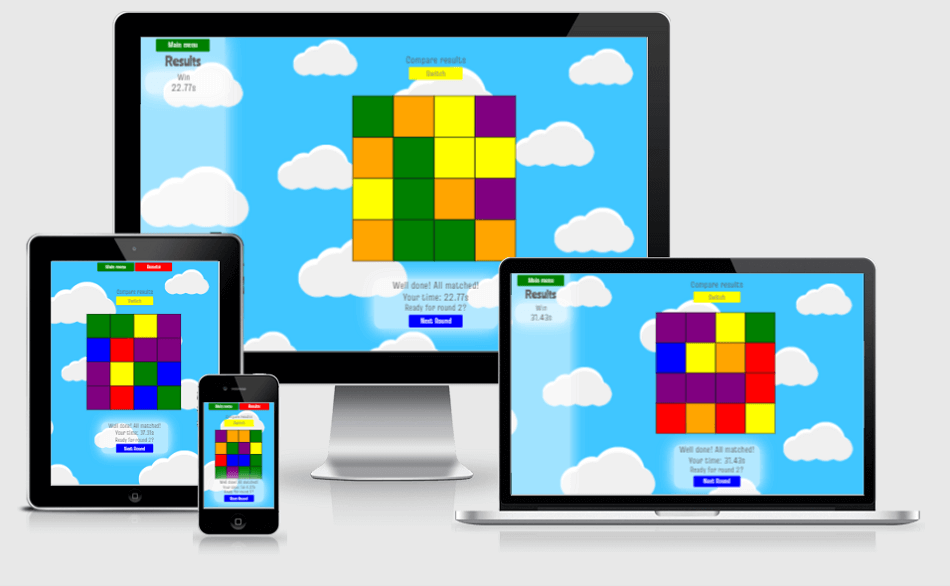

The responsive design test sheets and results can be viewed using the below links:
* [Menu Screens](assets/readme/testing_pattern-spiel_responsive_menu-screens.pdf)
* [Gameplay - View Pattern](assets/readme/testing_pattern-spiel_responsive_view-pattern.pdf)
* [Gameplay - Grid and Palette](assets/readme/testing_pattern-spiel_responsive_grid-palette.pdf)
* [Gameplay - Round End](assets/readme/testing_pattern-spiel_responsive_round-end.pdf)
* [Gameplay - Game End](assets/readme/testing_pattern-spiel_responsive_game-end.pdf)
* [Gameplay - Score Message](assets/readme/testing_pattern-spiel_responsive_score-message.pdf)
* [Other Screens](assets/readme/testing_pattern-spiel_responsive_other-pages.pdf)

Also successfully tested the live site on the following devices:
* Huawei P smart 2019 smart phone
* Samsung A12 smart phone 
* Samsung A21s smart phone
* Laptop at 1920 x 1080 resolution
* Amazon Fire HD 8 tablet
* Apple iPhone 5
* Apple iPad 7th Generation (iOS v 14.2) 
* Apple iPhone 5 and iPhone 8 - iphone 5 done

Only note on playing the game on mobiles; often the top menu/address bars meant that not all of the menu and game screens could be seen initially.  However swiping up to get rid of, or reduce the size of, the menu/address bars allowed all of the menu and game screen to be seen.

---
># **FUNCTIONALITY TESTING**
Functionality testing to ensure that the menu navigation, chosen game options, resulting gameplay and score functionality worked correctly and as expected, was conducted on a desktop PC using Google Chrome.

The functionality test sheets and results can be viewed using the below links:
* [Menu](assets/readme/testing_pattern-spiel_functional-menu.pdf)
* [Game](assets/readme/testing_pattern-spiel_functional-game.pdf)
* [Scoring](assets/readme/testing_pattern-spiel_functional-game-score.pdf)
* [Score - Saving and Display](assets/readme/testing_pattern-spiel_functional-score-save-display.pdf)
* [Other Screens](assets/readme/testing_pattern-spiel_functional-other-pages.pdf)

---
># **QUALITY CHECKS**
# Approach
## CSS style sheet:
The following quality checks were completed on the css style sheet (style.css):
* Manual review on comments against code to ensure relevancy.
* Manual review to ensure all quoted-out code was removed.
* Manual check of the spacing between code lines.
* Code run through [Autoprefixer](https://autoprefixer.github.io/) to ensure compatibility across browsers.
* Code checked on [W3C CSS validation](https://jigsaw.w3.org/css-validator/) using direct input.

## HTML:
The following quality checks were completed on each of the four HTML files:
* Manual review on comments against code to ensure relevancy.
* Manual review to ensure all quoted-out code was removed.
* Manual check of the spacing between code lines.
* Code checked on [W3C Markup Validation](https://validator.w3.org/) using direct input.

## JavaScript:
The following quality checks were completed on each of the three JavaScript files:
* Manual review on comments against code to ensure relevancy.
* Manual review to ensure all quoted-out code was removed.
* Manual check to ensure that all console.log entries were removed.
* Manual check of the spacing between code lines.
* Code checked on [JSHint](https://jshint.com/) using direct input.  Note that '//jshint esversion: 6' was entered at the top of the code window prior to pasting in JS code. This ensures that the feedback received from JSHint takes into account that the JS code uses ECMAScript 6 specific syntax.

## Website performance:
The site performance was tested on the following browsers by using Lighthouse :
* Chrome
* Opera
* Edge
* Firefox

N.B: Internet Explorer was not tested as the site uses ES6 so it's not fully compatible with Internet Explorer builds. 

---
# Results
## W3C CSS Validation:
* Errors: No errors found
* Warnings: 78 reported and no action taken as these were all related to the vendor extensions added by running the css through Autoprefixer.  So no action was taken to remove these.

## W3C Markup Validation:
* index.html: No errors or warnings to show.
* instructions.html: No errors or warnings to show.
* contact.html: No errors or warnings to show.
* highscores.html: No errors or warnings to show.

## JSHint:
* script_hs.js: No feedback received.
* script_cf.js: 
    * One unused variable - line 16: 'sendMail'.
    * One undefined variable - line 17: 'emailjs'.

        These are required for the EmailJS service to work and have been implemented as required.  Therefore no action taken in regards to this feedback.
    
* script.js: 
    * Three warnings: All stated:
        * 'Expected an assignment or function and instead saw an expression'. 
    
        This was for lines 869, 884 and 885 which are all instances, and the only instances, of the use ternary operators.  These were previously if-else statements but were changed to reduce the code.

        Researching this, an article was found [here](http://linterrors.com/js/expected-an-assignment-or-function-call) that stated that *'this error is raised to highlight a piece of useless and unnecessary code. The code will work as expected but since a lone floating expression has no effect on anything there is no point in it being there at all'*.  It also explained that JSHint can be made to ignore this warning.  Therefore as these operators are needed, this warning was noted but no action taken.

    * 11 unused variables.  These are:
        * selectDifficulty
        * setDifficultyVariables
        * gridSizeSelection
        * colourNumberSelection
        * viewTimerSelection
        * addColour
        * checkCompletion
        * patternCompareComputer
        * displayHighScore
        * saveHighScore
        * playAgain

        These are all functions and have been highlighted as these are the only functions called by 'onclick' event attributes that are written in HTML within template literals within other functions in the same JS file.  There are no onclick events coded within the HTML files.

        It is appreciated that the CI course material did state that event listeners should be used where ever possible to prevent code mixing and event listeners have been used in my code where it is appropriate.  However in these 11 instances it was considered that the onclick event attribute offered the more elegant solution.  Therefore no action taken to address these this time.

## Lighthouse results:
### Chrome:
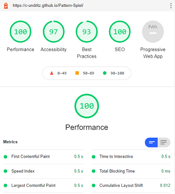
### Opera:
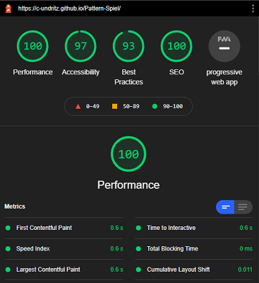
### Microsoft Edge:
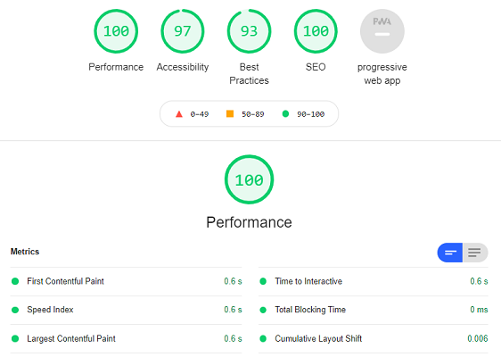
### Firefox:
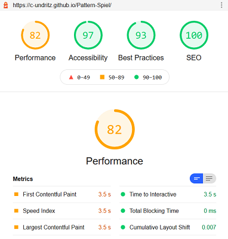

Testing on Safari browser was conducted by playing the game on a relatives PC whilst the developer observed and commented over a zoom call.  The game functioned as expected and no problems observed.

---
># **USER STORIES TESTING**
### The below details how the website meets the requirements of each user story. 

* *Be able to easily play the game on any device*
    * Responsive design is employed across all pages to deliver a satisfying UX on mobile, tablet, laptop and large desktop PC displays. See screenshots in 'Responsive Design Testing' above.

* *Have my memory skills challenged with a fun game*
    * The game asks the player to remember a random pattern which is shown for a limited time and then recreate it as fast as they can.  A simple and engaging game that uses bright primary colours where the fun comes from completing the pattern to get a match as fast as you can to get on the high score table.  Different set difficulties and a custom game features will ensure that it continues to challenge.

* *Have set difficulty levels so I can determine the level of challenge*
    * There are four 'set' difficulty levels where the game parameters (grid size, colours and view timer) are configured in a such a way as to make the game more challenging as the difficulty increases.
    
    Easy Difficulty:
    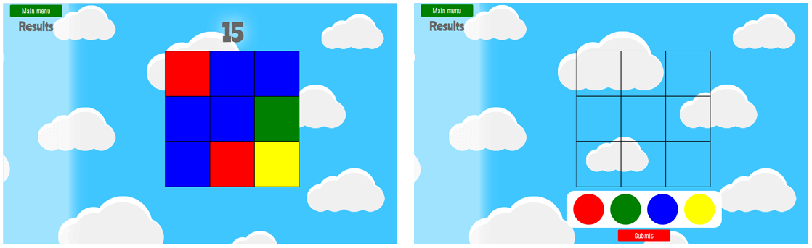

    Medium Difficulty:
    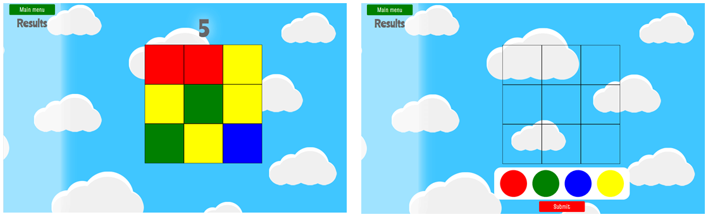

    Hard Difficulty:
    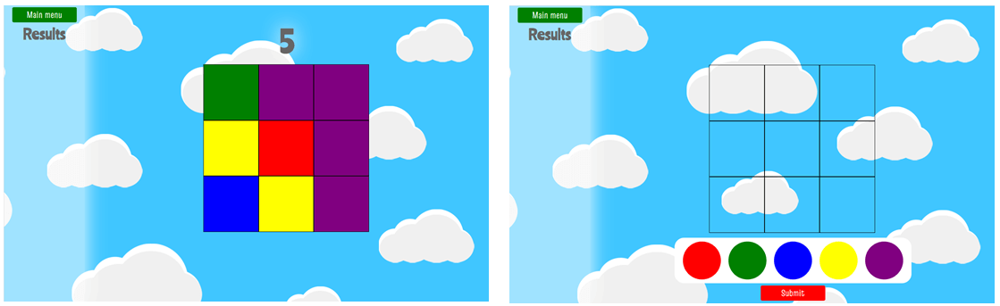

    Very Hard Difficulty:
    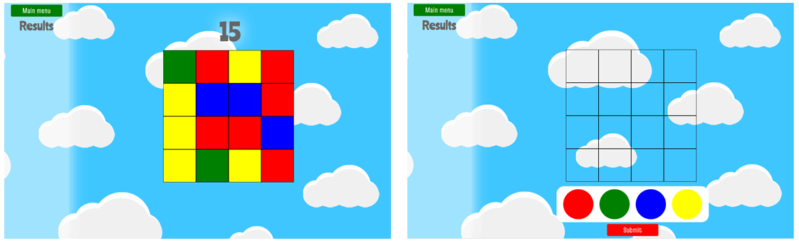

* *Customise the game options so I can set my own challenge*
    * The game has the option to define a custom game where the player can choose what size grid (3x3 or 4x4), up to how many colours may appear (4, 5 or 6 colours) and the amount of time they can have to memorise the pattern (5, 10 or 15 seconds, or no timer at all).  End game scores are shown but, due to the variable nature of the custom options, are not saved.

    Custom game - 3x3 grid, 15 second timer and up to 6 colours:
    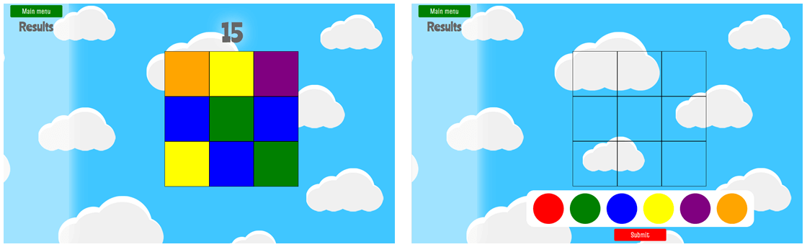

    Custom game - 4x4 grid, 10 second timer and up to 5 colours:
    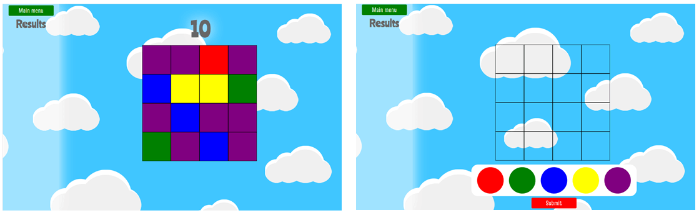

    Custom game - 3x3 grid, no timer and up to 4 colours:
    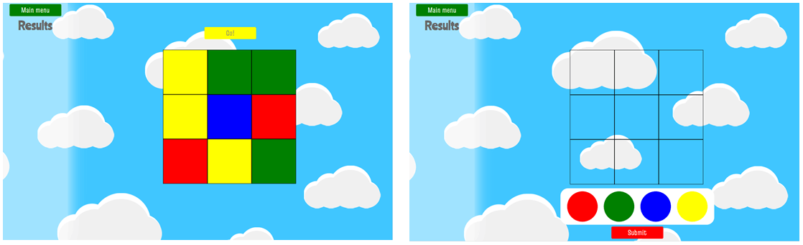

* *Have a record/score to see how much I have improved so as to challenge myself and my peers.*
    * During the game, the results column (or modal for tablet and smaller devices (accessed from the results button)) shows a win/loss and the time taken for each round. 
    * A score is then shown at the end of a game and the opportunity to save this should it be high enough to warrant a place in the high score table for that diffculty level.  
    * The high score tables are accessed from the 'High Scores' button in the main menu.

    Game screens showing game round results in column and modal:
    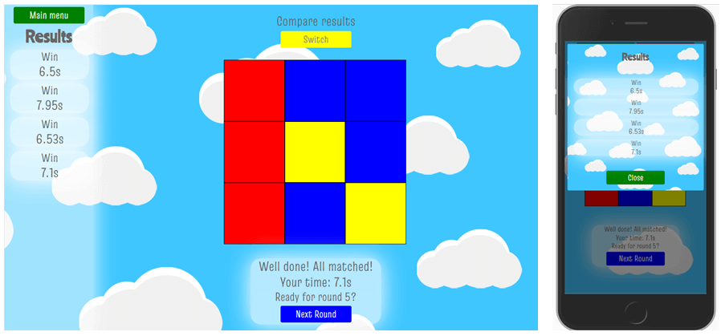

    Game screens showing end game high score message:
    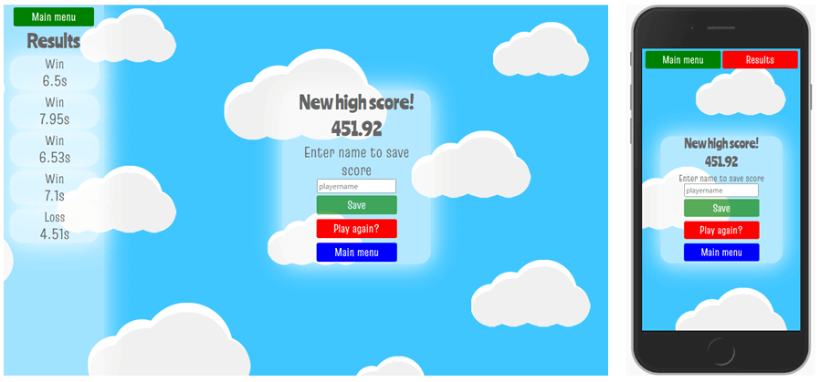

    The high scores page:
    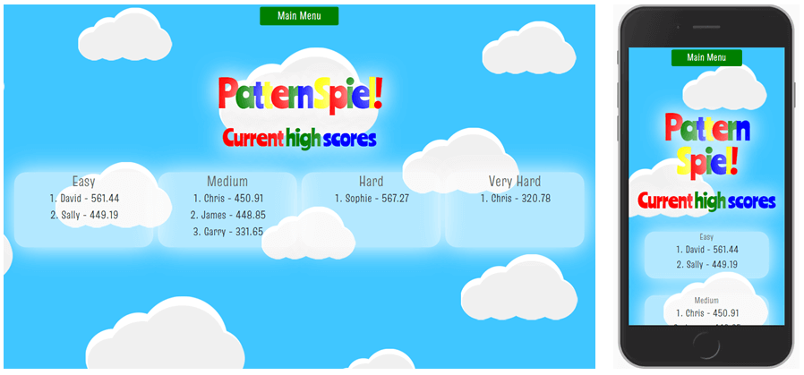

* *Be able to easily navigate the game and site.*
    * The game menu buttons are bright, obvious and have text clearly stating their purpose so that a user can get a game started within moments of entering the site.  
    * There is an ever present 'main menu' within the game screens which will take the player out of a game to the main menu.  
    * Navigation through the game is a mixture of obvious prompt buttons and automation so that, whilst there is a 'how to play' page, a player can quickly start playing without it.

* *Have clear instructions so I know how to play.*
    * There is a 'How to play' page that is easily accessed from the button of the same name, below the 'Start' button on the main menu/landing page 

    The How to Play page:
    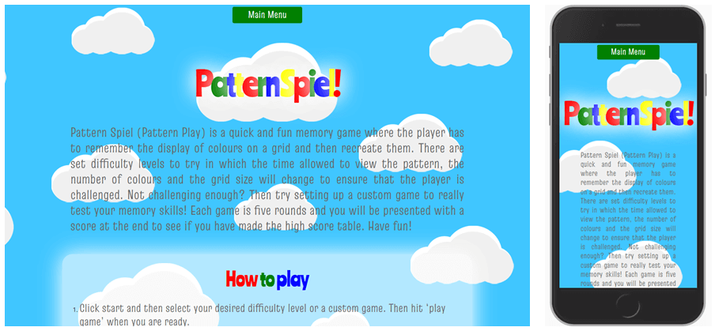

* *Be able to provide feedback/suggestions/issues to the developer.*
    * There is a 'Contact Us' page that is easily accessed from the yellow button alongside the social media icons at the bottom of the main menu/landing page.

    The Contact Us page:
    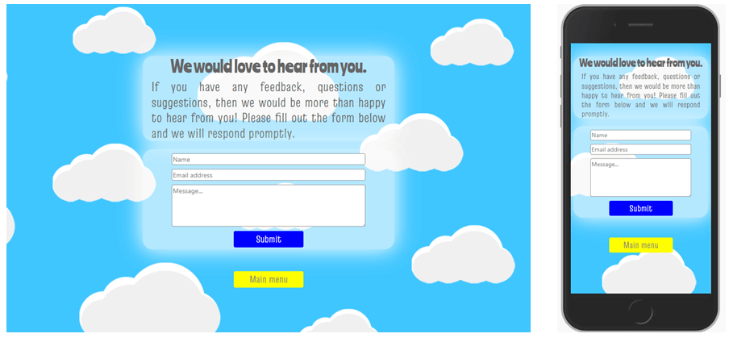

---
># **PROBLEMS AND FIXES**
## View Timer function
* The timer function code was learnt from a YouTube tutorial for a countdown timer.  However this was for a timer that was not involved in executing any functions once complete. It was found that when implemented that once the timer hit zero and the clearinterval() was invoked, that the timer actually carried on even though the display was not updating anymore and displayed '0'.
This meant that the generatePlayerGrid() being triggered by the timer was repeatedly being invoked and therefore repeatedly generated.  This meant that the user was not able to add colours.
* *Fix: Bim_Alumni informed me that the setInterval() method needed to be declared as a variable so that when there is a variable to declare with the clearInterval() method and stop the timer completely.*

## Responsive design on the score column
* It was required that the score column is not show on any device 768px width and below and instead the user accesses the score and main menu from a button that would appear at the top of the screen.  to do this bootstrap display property was used (https://getbootstrap.com/docs/4.6/utilities/display/) and the classes 'd-none' and 'd-lg-block' added to the score column created in the js file.  However adding these had the unexpected effect of overwriting the 'align-items-center' class and so the main menu button and text was justified left. Numerous options were tried to overcome this (adding in classes in different order, styling the column in css) but none worked. 
* *Fix: To overcome this the 'button' and 'h1' tags were placed in a div (where before this they were not needed to be in a div) and the div styled as 'text-align: center'*

## View timer not stopping when Main Menu button selected from game area
* clearInterval(patternDisplayTimer) was added the mainMenu() function however this did not result in the timer stopping and so whilst the user exited to the main menu from the game page whilst the time was counting down once the timer finished the user was then placed within the game page.
* *Fix: Within the viewTimer() function two event listeners were added for the Main menu button (one for the  score column and one for the mobile view buttons).  clearInterval(patternDisplayTimer) was added within a function for each of these.*

## Aspect ratio on the grid squares
* Initially css grid was used to create the grid, however extensive media queries were needed to provide responsiveness. So research provided the new css property 'aspect-ratio' and so the generateGrid function was updated along with the css to create the grid using this.  Along with using 'max-width', this resulted in a more responsive grid.  However testing revealed that the grid now did not work in Firefox (it worked in Edge, Chrome and Opera (did not have the opportunity to test Safari at that point)) due to this being a relatively new css property with a 64.96% usage at the time of writing ([caniuse.com page](https://caniuse.com/?search=aspect-ratio)).  
* *Fix: The aspect-ratio work around using css was used from [w3schools.com](https://www.w3schools.com/howto/howto_css_aspect_ratio.asp).  This meant that I needed to again define a separate css style for a 3x3 and 4x4 grid (using aspect-ratio this was not necessary) and also use the 'gridSize' variable in the class name for each square generated for the grid to target these styles.*

## Function generateGrid not working as expected following aspect-ratio change
* Following the change detailed above I had trouble getting the generateGrid function to work and build the grid correctly. 
* *Fix: Eventually posted the issue on stackoverflow [here](https://stackoverflow.com/questions/66833813/building-html-using-loops-in-js) where the helpful community pointed out that one of my statements needed to be moved up a level into a loop.  This fixed this issue and the grid generates perfectly.*

## Multiple saves of a single score
* The save score interface was adapted from a YouTube tutorial as detailed in the README.  In this, to prevent a score being saved twice, the save score button was disabled once the player had entered their name.  However, if the player then deleted/added/changed even one character of their name, the save button was re-enabled and so the same score could be saved again.  Additionally if the player entered their name and hit 'enter' instead of clicking on the save button, the score was saved, but the save button not disabled.
* *Fix: to prevent this from occurring, it was decided that the form element and button would be removed from the message following player name entry and clicking save.  They are then replaced with the message stating 'Score saved'.  This also had the benefit of when the player enters their name and hits 'enter' the form element and button are still removed and replaced with the message.*

---
># **REMAINING ISSUES**
## Screen resolution and scaling
* The game works across a number of screen sizes as the testing completed shows.  However on desktop and laptop screens it was noted that elements of the games layout overlapped if the scale (zoom) was high.  An early requirement of the game was for all elements to be presented on one screen so at all points; everything the player needs is visible.  This has been achieved at the resolutions tested even though there are quite a few elements to the games interface that change and swap as a game progresses.  However it was found that if a user was zoomed in (had a scale of over 100%) then elements of the games interface started to overlap.  This does happen on other web games however it does seem that my game is sensitive to it. No fix was able to be put in place for this deployment, but it is something that can be looked into for the future. 

## Dark mode on Samsung internet
* Testing on mobile devices revealed an issue with the display of the games colours when Samsung internet is in dark mode.
The screen grabs below shows the main menu in Samsung internet in light mode and then in dark mode.
* 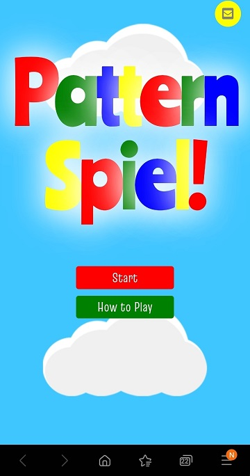 * 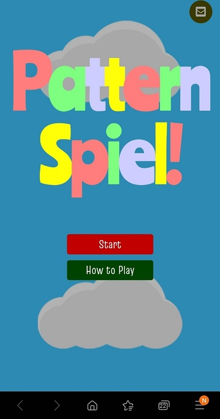
* The game looks fine in other browser dark modes.  It is documented [here](https://interaction.net.au/articles/samsung-internet-and-night-mode/) the issues with
the dark mode on Samsung internet.  I was unable to implement the fixes recommended and so this is reported but not addressed.  At the time of writing according to caniuse.com, Samsung internet has a global usage of 2.64% and many of these will unlikely be in dark mode.

## Colourful game title
* Within the JavaScript within the mainMenu function on line 67, there is one long line of HTML which is the game title on the menu screen.  The game title on the menu screen is styled so that each letter is coloured in one of the four primary colours.  To achieve this each letter was set between html 'span' tags with the class attribute for the colour the letter needed to be.  This resulted in one long line of html (see script.js, mainMenu function, line 67).  I tried to set each span tag on a separate line to make it neater however this increased the space between each letter and so it needed to be kept one line.  Also tried a loop using similar methods to that shown in [this](https://www.youtube.com/watch?v=sGJ5lTu-clY) video, but could not get that to work.  It is something that I will continue with (outside of the project code of course) as I think it could be made to work.  For now the unwieldy and unattractive 'span' line is what is in place. 